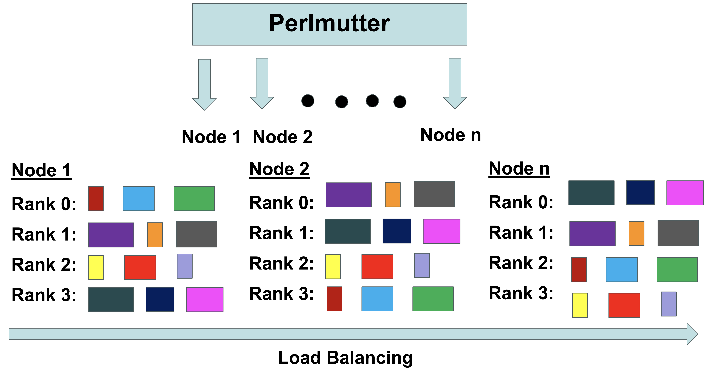

# Exploring Dynamic Load Balancing Algorithms for Block-Structured Mesh-and-Particle Simulations in AMReX

## **Abstract**

Load balancing is a critical requirement for successful large-scale HPC simulations. However, traditional load-balancing strategies have competing limitations. In this research, we explore dynamic novel hybrid load balancing algorithms, starting with Bruteforce and then Knapsack and SFC, and then combining both Knapsack and SFC and SFC Painter Partition. The result stated that the Painter SFC method is the optimal algorithm for real-world applications. Initial investigations into building this algorithm are outlined as the first steps toward applying this novel algorithm to a WarpX simulation.

## **Background**

**What is AMReX**

AMReX is the block-structured adaptive mesh refinement (AMR) software framework for solving partial differential
equations (PDEs).

• AMR is a common cause of load imbalance during simulations. Multi-level meshes lead to complex load distributions that require careful balancing to obtain optimal runtime.

• AMReX provides the necessary tools to manage and optimize computational meshes, particles, parallel processing, input/output, and visualization for high-performance simulations.


**What is Load Balancing**

• Load balancing is a process of distributing computational tasks evenly across available processors or nodes to maximize   efficiency and minimize idle time.

• AMReX provides Space-filling curve and Knapsack load balancing algorithms.




## **Folder Structure**

```
PASC_2025_Paper_Artifact
│
└───bin
└───output
└───result
└───src
    │ 
    └───BruteForce.cpp
    └───SFC.cpp/SFC.H
    └───SFC_knapsack.cpp/SFC_knapsack.H
    └───Knapsack.cpp/Knapsack.H
    └───PainterPartition.cpp/PainterPartition.H
    └───main.cpp
    └─── notebooks
         │ 
         └───metrics_calculation_avg.ipynb
         └───metrics_calculation_best.ipynb
         └───metrics_calculation_worst.ipynb
         └───sfc_knapsack_plot.py
    
└───GNUmakefile
└───LICENSE
└───Make.package
└───experiment.sh
└───inputs
└───requirements.yaml
└───README.md
    
```

## **Prerequisites**

### **System Requirements**

- **Operating System:** macOS, Linux, or similar Unix-based systems
- **Compiler:** GCC (version 9.0 or later) or Clang supporting C++17 or later.
- **Build Tools:** make utility for building the code.
- **Shell:** Bash for running shell scripts.

### **Dependencies**

- **AMReX :** A software framework for building parallel AMR applications.
- **CMake:** Version 3.15 or later for configuring the build system.
- **MPI:** OpenMPI for parallel execution (if required). 


   
## **Getting Started**

These instructions will get you a copy of the project up and running on your local machine for development and testing purposes.

### **Installation**

1. First clone the repository to your local machine:
   ```
   git clone https://github.com/amitashnanda/PASC_2025_Paper_Artifact.git

   cd PASC_2025_Paper_Artifact

   ```
2. Install and Build AMReX from the step here:

   https://amrex-codes.github.io/amrex/docs_html/BuildingAMReX_Chapter.html

3. For running the python files and notebooks create a conda environemnt using this file.
   ```
   conda env create -f requirements.yaml

   ```
### **Build Instructions**

1. Navigate to the Repository Root:

   ```
   cd /path/to/PASC_2025_Paper_Artifact

   ```
2. Configure the Makefile:

   Ensure your Make.package file includes the correct paths to AMReX headers and libraries also all files headers and sources. 

3. Compile the Code:

   ```
   make -j 

   ```
   This will generate the executable main3d.gnu.x86-milan.TPROF.ex 

### **Run Instructions**

1. Navigate to the Repository Root:

   Change the ```inputs``` as per your requirement. You can change the ```mean```, ```standard_deviation```, ```no_of_runs```, ```domain_size```, ```max_grid_size``` . 

2. Run the experiment file

   ```
   ./experiment.sh

   ```
3. Direct Execution

   ```
   ./main3d.gnu.x86-milan.TPROF.ex inputs nnodes=2 domain="(256,256,256)" max_grid_size= "(128,128,128)" > output/2_4_output_worst.txt

   ```

## **Contributing**

1. Fork the Repository:

   Click the "Fork" button on the top right of the repository page.

2. Clone Your Fork:
   ```
   git clone https://github.com/yourusername/PASC_2025_Paper_Artifact.git

   cd PASC_2025_Paper_Artifact

   ```
3. Create a New Branch:

   ```
   git checkout -b feature/YourFeatureName

   ```
4. Make Your Changes: 

   Implement your feature or bug fix.

5. Commit Your Changes:

   ```
   git commit -m "Add feature: YourFeatureDescription"

   ```

6. Push to Your Fork:

   ```
   git push origin feature/YourFeatureName

   ```

## **License**

This project is licensed under the [Apache License](LICENSE).


## **Acknowledgments**

1. **AMReX Team**
2. **Perlmutter Supercomputer**
3. **Lawrence Berkeley National Laboratory**
4. **National Energy Research Scientific Computing Center**


